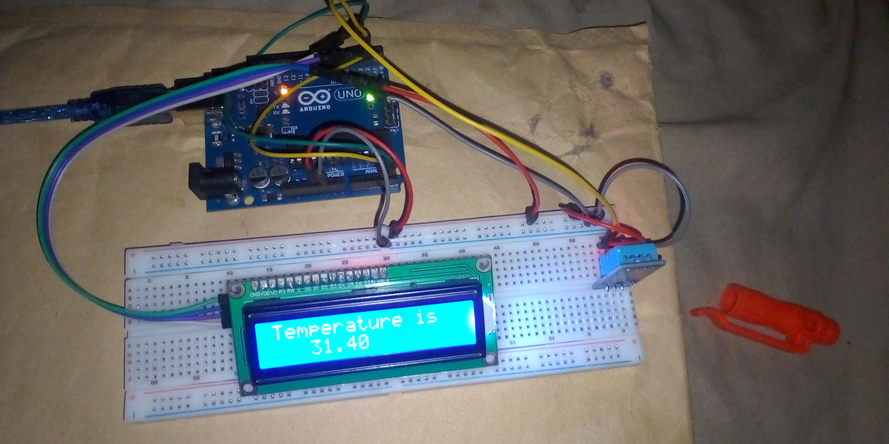

# Digital Thermometer with LCD Display - ARDUINO PROJECT

## Overview
This project implements a digital thermometer using an Arduino, a DHT11 temperature sensor, and a 16×2 I2C LCD display. The system continuously reads the ambient temperature and displays the value in real time on the LCD screen.

## Objective
- Learn how to interface the DHT11 temperature sensor with Arduino  
- Display sensor readings on a 16×2 I2C LCD  
- Understand I2C communication using `LiquidCrystal_I2C`  
- Handle invalid sensor readings safely  
- Practice real-time data display in embedded systems  

## Components Used
- Arduino Uno  
- DHT11 Temperature Sensor  
- 16×2 I2C LCD Display  
- Jumper wires  
- Breadboard  
- 9V Battery  
- 9V Battery Clip to DC Barrel Jack  

## Circuit Diagram

[Click Here for Other images](images/)
## How It Works
1. The DHT11 sensor is connected to digital pin `2` and initialized using the `DHT` library.  
2. The LCD communicates with the Arduino via I2C using pins `A4` (SDA) and `A5` (SCL).  
3. The Arduino reads the temperature value from the DHT11 sensor every second.  
4. If the temperature reading is invalid (`NaN`), the LCD displays an error message.  
5. When a valid reading is obtained, the temperature is displayed on the LCD screen.  
6. The LCD refreshes periodically to show updated temperature values.  

## Code
The Arduino sketch for this project is located in the [code/ directory](code/digital_thermometer_with_lcd_project_on_9th_november_2025.ino).

## Demo Video
A demonstration video showing the working project is included in this repository.

📹 **Project Demonstration:**  
[Click here to watch/download the demo video](video/)

*(If the video does not preview directly on GitHub, please download it using the link above.)*

## Reflection (What I Learned)
- Interfacing temperature sensors with Arduino  
- Using I2C communication for LCD displays  
- Displaying real-time sensor data  
- Handling sensor read errors effectively  

## Challenges Faced
- Handling invalid temperature readings from the DHT11 sensor  
- Managing LCD refresh timing to avoid flickering  
- Ensuring stable I2C communication  

## Possible Improvements
- Display humidity alongside temperature  
- Add temperature unit switching (°C / °F)  
- Implement data logging using Serial or SD card  
- Improve error handling with clearer LCD messages  

## Project Status
Completed
